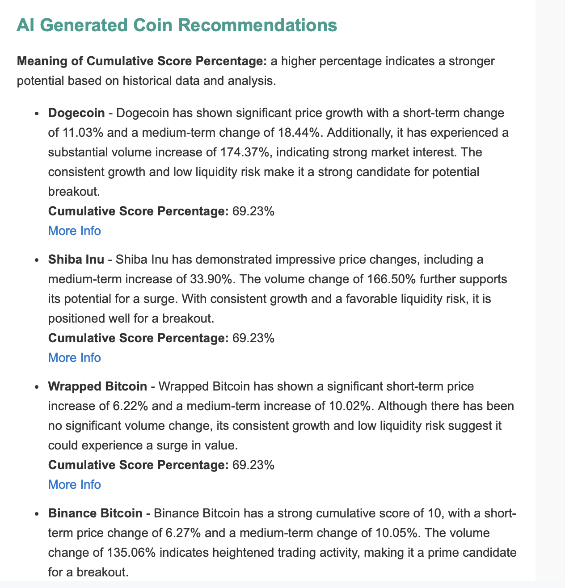

# 🐼 Crypto-Panda: Cryptocurrency Analysis & Reporting Tool

[](https://github.com/sjmoran/crypto-panda)
[](https://creativecommons.org/licenses/by-nc/4.0/)
[](https://github.com/sjmoran/crypto-panda/stargazers)
[](https://github.com/sjmoran/crypto-panda/issues)
[](https://www.python.org/downloads/)


---

## 🔍 What is Crypto-Panda?

**Crypto-Panda** is a smart, automated reporting tool that tracks the cryptocurrency market, analyzes patterns using both quantitative signals and AI, and emails you a weekly report on the coins worth watching.

Powered by Python, OpenAI's GPT-4o, Santiment, and CoinPaprika APIs — it's designed to help you cut through the noise and make sense of the chaos.

---

## 🧠 What It Can Do

- 📈 **Market Trend Analysis**  
  Pulls historical price/volume data via CoinPaprika and analyzes short- and long-term trends.

- 🧪 **Santiment Intelligence**  
  Tracks developer activity, daily active addresses, and other on-chain signals.

- 📰 **News & Social Sentiment**  
  Uses VADER and GPT-4o to extract sentiment from headlines and social chatter.

- 🚀 **Surge Detection**  
  Uses a composite scoring mechanism to flag coins with breakout potential.

- 🤖 **GPT-4o Investment Suggestions**  
  Generates natural-language investment suggestions from raw data.

- 📬 **Weekly HTML Report by Email**  
  Fully automated and ready for inboxes.

- 🔁 **Reliable API Access**  
  Includes built-in retry handling for flaky requests.

---

## 📊 Full Metric Reference Table

This table outlines all the metrics analyzed for each cryptocurrency in your pipeline, grouped by theme and annotated with their range, usage, and description.

| **Category**        | **Metric**                            | **Key**                                   | **Range / Type**       | **Used In**                     | **Description** |
|---------------------|----------------------------------------|--------------------------------------------|-------------------------|----------------------------------|-----------------|
| 📈 Price            | Price Change Score                     | `price_change_score`                       | 0–3                    | Final Score                     | Momentum over short, medium, and long-term windows |
| 📈 Price            | Consistent Weekly Growth               | `consistent_growth_score`                  | 0–1                    | Final Score                     | ≥ 4 up-days in last 7 |
| 📈 Price            | Consistent Monthly Growth              | `consistent_monthly_growth`                | 0–1                    | Final Score                     | ≥ 18 up-days in last 30 |
| 📈 Price            | Trend Conflict                         | `trend_conflict_score`                     | 0–1                    | Final Score                     | Monthly uptrend without short-term support |
| 📊 Volume           | Volume Change Score                    | `volume_change_score`                      | 0–3                    | Final Score                     | Surges over 3 timeframes based on market cap/volatility |
| 📊 Volume           | Sustained Volume Growth                | `sustained_volume_growth`                  | 0–1                    | Final Score                     | ≥ 4 volume-up days in last 7 |
| 📉 Liquidity        | Liquidity Risk                         | `liquidity_risk`                           | Low/Medium/High        | Explanation                     | Based on 24h volume vs market cap tier |
| 💬 Sentiment        | Tweet Score                            | `tweet_score`                              | 0–1                    | Final Score                     | Tweets found via CoinPaprika |
| 💬 Sentiment        | News Sentiment Score                   | `sentiment_score`                          | 0–1                    | Final Score                     | VADER sentiment of news (compound > 0.5 = 1) |
| 💬 Sentiment        | Surge Keywords Score                   | `surging_keywords_score`                   | 0–1                    | Final Score                     | Detects bullish phrases in recent news |
| 💬 Sentiment        | Fear & Greed Score                     | `fear_and_greed_score`                     | 0–1                    | Final Score                     | Based on Alt.me index crossing threshold |
| 📰 News/Events       | Digest Mention                         | `digest_score`                             | 0–1                    | Final Score                     | If coin is in curated Crypto Digest |
| 📰 News/Events       | Trending Score                         | `trending_score`                           | 0–2                    | Final Score                     | Trending mentions from CryptoNewsAPI |
| 📰 News/Events       | Event Score                            | `event_score`                              | 0–1                    | Final Score                     | Coin has events in last 7 days |
| 🧠 Santiment         | Dev Activity Increase                  | `dev_activity_increase`                    | % (0–∞)                | `santiment_score`, Surge Score | 30d % change in developer activity |
| 🧠 Santiment         | Active Addresses Increase              | `daily_active_addresses_increase`          | % (0–∞)                | `santiment_score`, Surge Score | 30d % change in unique addresses |
| 🧠 Santiment         | Exchange Inflow (USD, 1d)              | `exchange_inflow_usd`                      | USD                    | `exchange_flow_delta`          | Token flow into exchanges (bearish) |
| 🧠 Santiment         | Exchange Outflow (USD, 1d)             | `exchange_outflow_usd`                     | USD                    | `exchange_flow_delta`          | Token flow out of exchanges (bullish) |
| 🧠 Santiment         | Whale Transaction Count (>$100k)       | `whale_transaction_count_100k_usd_to_inf`  | Count                  | Surge Score                     | Whale trades in last 24h |
| 🧠 Santiment         | Tx Volume Change (1d)                  | `transaction_volume_usd_change_1d`         | %                      | Surge Score                     | Change in USD volume day-over-day |
| 🧠 Santiment         | Weighted Sentiment (1d)                | `sentiment_weighted_total`                 | Score (-1 to +1)       | Surge Score                     | Weighted community + market sentiment |
| 🧠 Santiment         | Santiment Score                        | `santiment_score`                          | 0–2                    | Final Score                     | Binary from dev + address increase |
| 🧠 Santiment         | Santiment Surge Score                  | `santiment_surge_score`                    | 0–6                    | Final Score                     | Composite of 6 Santiment surge metrics |
| 🧠 Santiment         | Santiment Surge Explanation            | `santiment_surge_explanation`              | Text                   | Explanation                     | Explains triggers for surge score |
| ✅ Final             | Cumulative Score                       | `cumulative_score`                         | 0–22                   | —                                | Sum of all metrics |
| ✅ Final             | Cumulative Score %                     | `cumulative_score_percentage`              | 0–100%                | —                                | Normalized version of final score |
| 🧾 Bonus             | News Headlines                         | `coin_news`                                | List of dicts         | Display / Explanation          | Top 3 recent headlines for the coin |
| 🧾 Bonus             | Full Explanation                       | `explanation`                              | String                 | Reporting                      | Human-readable summary of metrics |
---

## 📬 Example Report

Each weekly email includes top-ranked coins and GPT-generated insights:



---

## ⚙️ Requirements

- Python 3.8+
- Install dependencies via:

```bash
pip install -r requirements.txt
```

---

## 🔐 Environment Variables

Create a `.env` file with the following:

```env
COIN_PAPRIKA_API_KEY=
OPENAI_API_KEY=
CRYPTO_NEWS_API_KEY=
SAN_API_KEY=
EMAIL_FROM=
EMAIL_TO=
SMTP_SERVER=
SMTP_USERNAME=
SMTP_PASSWORD=
```

---

## 🚀 Quickstart

```bash
git clone https://github.com/sjmoran/crypto-panda.git
cd crypto-panda
pip install -r requirements.txt
python monitor.py
```

> 💡 Run weekly via cron, Lambda, or EventBridge.

---

## ⚙️ Config Options

| Variable                                | Description                                    |
|----------------------------------------|------------------------------------------------|
| `TEST_ONLY`                             | Run on a small subset for testing              |
| `RESULTS_FILE`                          | Output filename for saving results             |
| `HIGH_VOLATILITY_THRESHOLD`            | Flag coins with high volatility                |
| `FEAR_GREED_THRESHOLD`                 | Fear & Greed Index threshold                   |
| `CUMULATIVE_SCORE_REPORTING_THRESHOLD` | Min score required to include coin in report   |

---

## 📊 Metrics Tracked (via Santiment)

- **Development Activity** – GitHub commit activity  
- **Daily Active Addresses** – Network usage metrics  
- **Sentiment Signals** – From media and social platforms  
- **Price & Volume** – Historical performance data

---

## 🤖 GPT-4o Intelligence

GPT-4o combines market, sentiment, and social signals to generate:
- Natural-language investment briefs
- Summarized outlooks
- Coin-specific recommendations

---

## ☁️ Deployment Notes

Deploy cheaply on AWS using:
- EC2 `t2.micro` instance (shutdown after 96h)
- Lambda + EventBridge for scheduling
- CloudFormation for VPC and IAM setup

> Runtime (1000 coins): ~20 hours  
> API Costs (monthly): ~$100 with paid tiers

---

## 🛠️ Contributing

PRs welcome!  
Fork → Improve → Submit a pull request 💪

---

## 📬 Contact

Open an [issue](https://github.com/sjmoran/crypto-panda/issues) with questions or feedback.

---

## ⚠️ Disclaimer

> **Not financial advice.**  
> Use this project at your own risk. Always do your own research and consider consulting a licensed advisor before making trading decisions.

---

## 📄 License

This project is licensed under [CC BY-NC 4.0](https://creativecommons.org/licenses/by-nc/4.0/).  
See the [LICENSE](LICENSE) file for more.

---

## 🙏 Acknowledgments

- [CoinPaprika API](https://api.coinpaprika.com/)
- [Santiment API](https://santiment.net/)
- [OpenAI GPT-4o](https://openai.com/)
- [Fear and Greed Index](https://alternative.me/crypto/fear-and-greed-index/)
